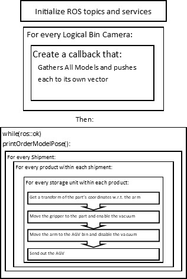

# Final

### How the package works:

- Runs Gazebo via these lines in the launch file:
  - ```
    <include file="$(find ecse_373_ariac)/launch/ecse_373_ariac.launch">
        <arg name="python" value="false"/>
    </include>
    ```
- We wait for the competition to reach the 'go' state
- Then we subscribe to the `/ariac/orders` topic
  - Once orders are received, they are pushed onto our `order_vector` queue
- We subscribe to each logical camera and using [C++11 lambdas](https://en.cppreference.com/w/cpp/language/lambda), 
  we dynamically generate camera callbacks to handle new objects from the 
  `order_vector` queue
  - From here, we use the `GetMaterialLocations` service to query the location of
    the product
  - If the location productType matches the type in the respective camera's
    queue, then we print the position via ROS_WARN 


### Launching:

Launch the program using the attached launch file:
`roslaunch ecse373_f22_group5 lab5.launch`

### Theory of Operation:

